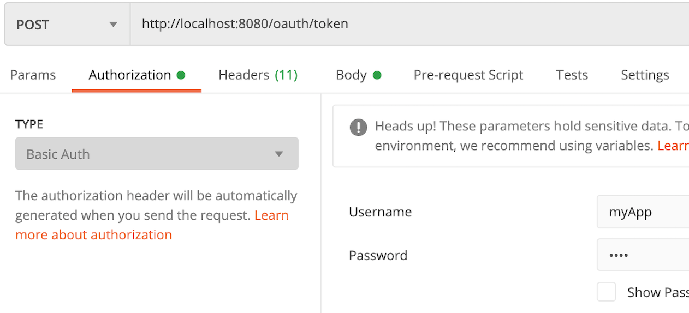
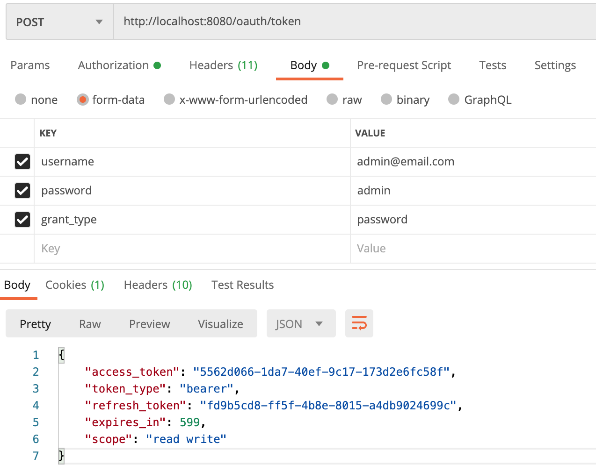
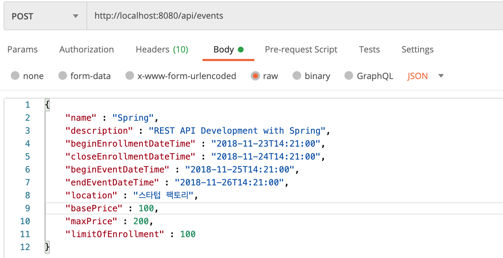
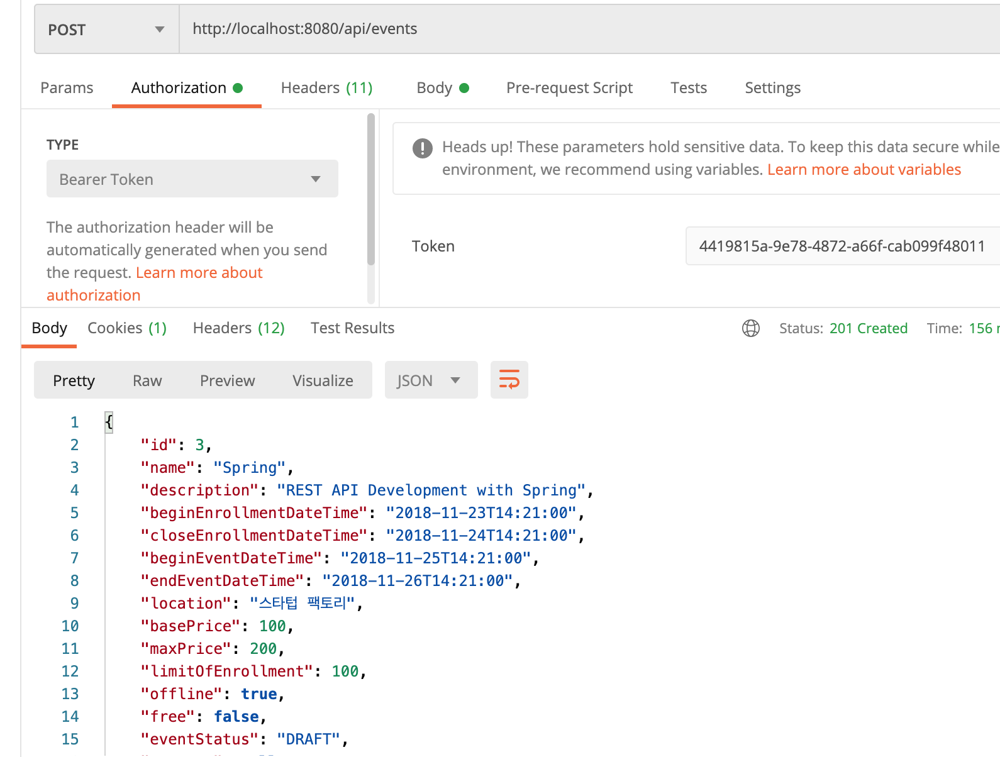

# REST API
# REST API 보안 적용
   

# 스프링 시큐리티
스프링 시큐리티 의존성을 추가하여 사용하는 순간부터  
모든 요청은 인증을 필요로 하게 된다.  
그리고 임의의 사용자 하나를 인메모리에 만들어준다.  
 

# 스프링 시큐리티 OAuth 2.0
## AuthorizationServer
OAuth2 토큰 발행(/oauth/token) 및 토큰 인증(/oauth/authorize)
> Order 0 (리소스 서버보다 우선순위가 높다.)
## ResourceServer
리소스 요청 인증 처리 (OAuth2 토큰 검사)
> Order 3 (이 값은 현재 고칠 수 없음.)

   

# 스프링 시큐리티 OAuth 2.0 적용 
### * 이 예제에서는 OAuth2가 지원하는 Grant Type 중 Password 방식과 Refresh Token 방식을 사용한다.  
1. Password 방식: 서비스 오너가 만든 클라이언트에서 사용하는 Grant Type. 
즉, 사용자 정보(패스워드 같은 인증정보)인 데이터를 가지고 있는 그 서비스가 만든 앱에만 사용해야 한다. 
서드파티에 이 방식을 제공해서는 안된다. 사용자가 패스워드를 직접 입력해야 하기 때문에.. 
https://developer.okta.com/blog/2018/06/29/what-is-the-oauth2-password-grant  
 

2. Refresh Token: access_token을 발급받을 때 refresh_token도 같이 발급 받는다.  
이 refresh_token을 가지고 새로운 access_token을 발급받는 방식이다.   
 

### * 이 예제에서는 최초 access_token을 발급 받을 때 Password라는 Grant Type으로 발급을 받을 것이다.  
Password는 다른 Grant Type과는 다르게 홉이 한번이다. (즉, 요청과 응답이 한쌍이다.)  
한번 요청으로 토큰을 바로 발급 받을 수 있다.  
(다른 Grant Type은 토큰을 발급받기 위한 토큰을 받는 방식으로 더 과정이 복잡하다.)  
 

### * Password 방식에서 토큰(access_token)을 요청할 때에는 아래와 같은 정보들이 필요하다.
<pre>
grant_type=password
&username=[사용자계정]
&password=[패스워드]
&client_id=[클라이언트 아이디]
&client_secret=[클라이언트 시크릿]
</pre>
client_id와 client_secret은 BasicAuthentication 형태로 헤더에 넣어줄 수 있다.  
나머지 grant_type, username, password는 요청의 파라미터로 넘겨줄 수 있다.  
  

### 1. 먼저 Authorization Server와 Resource Server가 공통으로 사용할 설정 파일 만들기.  
=> me.sombrero.demorestapi.configs.SecurityConfig.java 파일 참조.  
 

### 2. UserDetailsService를 상속받는 AccountService를 만든다. 
(DB에서 username으로 찾아서 꺼내온 사용자 정보를 UserDetails로 반환하는 loadUserByUsername()을 구현한다.) 
=> me.sombrero.demorestapi.accounts.AccountService.java 파일 참조.  
 

### 3. 인증 토큰 발급을 위한 Authorization Server 설정 파일 만들기. 
인증 토큰을 발급하기 위한 설정인 AuthorServerConfig를 만든다. 
기본으로 인증서버가 등록이 되면 '/oauth/token'이라는 토큰 발급 요청을 처리할 수 있는 핸들러가 적용된다.  
=> me.sombrero.demorestapi.configs.AuthorServerConfig.java 파일 참조.  
 

### 4. Resource Server 설정 파일 만들기.
=> me.sombrero.demorestapi.configs.ResourceServerConfig.java 파일 참조.  
 

   

# Postman으로 요청 확인하기
 

## access_token 토큰 발급 받기 
POST 요청으로 URL을 'http://localhost:8080/oauth/token'으로 입력하고  
Authorization 탭에서 Type을 'Basic Auth'로 선택한 후,  
username에는 client_id를, Password에는 client_secret을 입력한다.  

  

그리고 Body 탭에서 회원정보인 username, password를 입력하고, 
grant_type을 'password'로 입력한 후  
요청을 하면 access_token과 refresh_token이 발급된 것을 확인할 수 있다.   

  
  

## 위에서 발급 받은 access_token 토큰 사용하기
### 이벤트 생성하기 
POST 요청으로 URL을 'http://localhost:8080/api/events'으로 입력하고 
Body 탭에서 raw 옵션을 선택 후 셀렉트 옵션에서 'JSON' 포맷으로 선택한다.  
그리고 추가할 이벤트 내용을 JSON 포맷으로 작성한다.   

  

Authorization 탭에서 Type을 'Bearer Token'으로 선택한 후, 
위에서 발급받은 access_token을 입력한다.  
그리고 요청을 하면 이벤트가 정상적으로 추가되고 추가된 이벤트에 대한 내용을 확인할 수 있다.   

  
   

https://www.baeldung.com/spring-security-oauth-resource-server   
https://dassum.medium.com/securing-spring-boot-rest-api-with-json-web-token-and-jdbc-token-store-67558a7d6c29   
   

* jUnit4 패키지: org.junit.Test; 
* jUnit5 패키지: org.junit.jupiter.api.Test; 
   